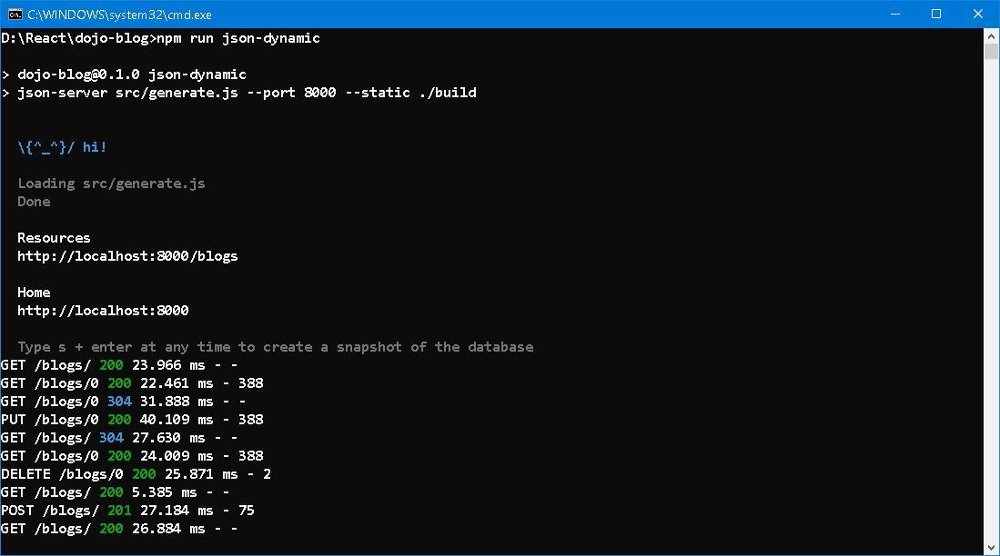
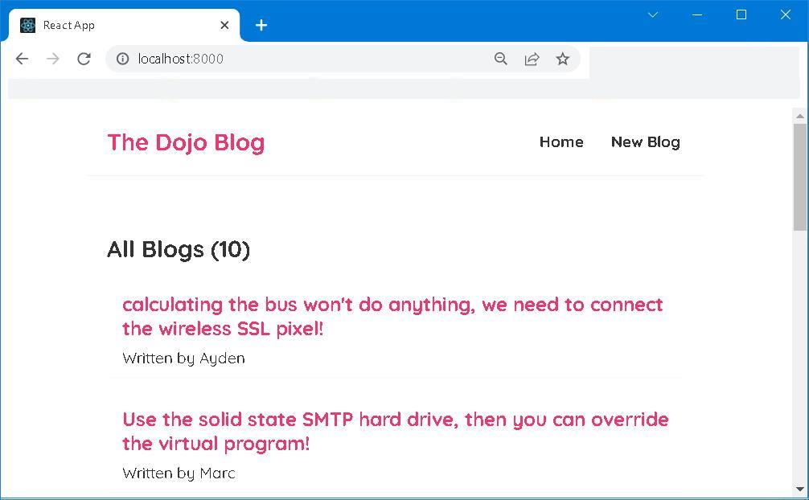

# dojo-blogs 


## Forward


## I. To prepare
> [React](https://reactjs.org/) is a JavaScript library for building user interfaces.
```bash
cd myapp
npx create-react-app . 
npm install json-server --save-dev
```
if you prefer dynamic generated json data, you need two more packages
```bash 
npm install lodash --save-dev
npm install @faker-js/faker --save-dev
```
package.json
```json
{
  "name": "dojo-blog",
  "version": "0.1.0",
  "private": true,
  "dependencies": {
    "@testing-library/jest-dom": "^5.16.5",
    "@testing-library/react": "^13.4.0",
    "@testing-library/user-event": "^13.5.0",
    "react": "^18.2.0",
    "react-dom": "^18.2.0",
    "react-router-dom": "^5.3.3",
    "react-scripts": "5.0.1",
    "web-vitals": "^2.1.4"
  },
  "scripts": {
    "start": "react-scripts start",
    "build": "react-scripts build",
    "test": "react-scripts test",
    "eject": "react-scripts eject",
    "json-server": "json-server data/db.json --watch --port 8000 --static ./build",
    "json-dynamic": "json-server src/generate.js --port 8000 --static ./build",
    "dev": "nodemon server"
  },
  "eslintConfig": {
    "extends": [
      "react-app",
      "react-app/jest"
    ]
  },
  "browserslist": {
    "production": [
      ">0.2%",
      "not dead",
      "not op_mini all"
    ],
    "development": [
      "last 1 chrome version",
      "last 1 firefox version",
      "last 1 safari version"
    ]
  },
  "devDependencies": {
    "@faker-js/faker": "^7.5.0",
    "json-server": "^0.17.0",
    "lodash": "^4.17.21"
  }
}
```


## II. To put in work 
```bash
npm run json-server
```
or 
```bash
npm run json-dynamic
```



## III. To Round up
- Navigate to <code>http://localhost:8000</code>




## IV. Reference
1. [Full Modern React Tutorial](https://www.youtube.com/playlist?list=PL4cUxeGkcC9gZD-Tvwfod2gaISzfRiP9d)
2. [typicode/json-server](https://github.com/typicode/json-server)
3. [Simplicity but not simple](https://github.com/Albert0i/json-server-tutorial)


## EOF (2022/09/21)